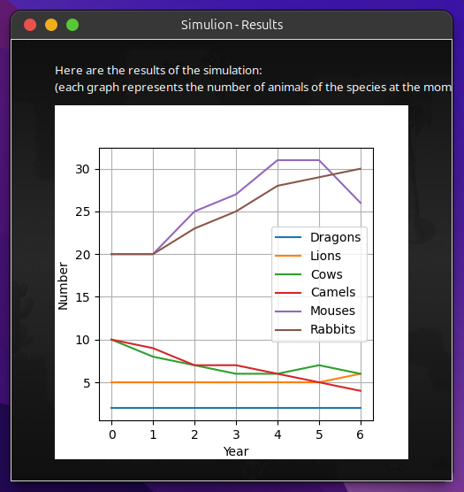

# SIMULION — Ecosystem Simulaton


**SIMULION** is a program designed to **simulate ecosystems** populated by multiple species of animals in order to observe their **behaviors and interactions** over time.  
The project combines a **2D RPG-style simulation** with **dynamic statistics and visualization**.

---

## Features

- **Interactive GUI**
  - Welcome screen with **help section** and **simulation setup panel**. 
  - Information overlay: planet age, animal count, FPS, and simulation state. 
  - **Help page** accessible at runtime. 

- **Simulation**
  - Animals interact with each other and their environment: **movement, feeding, reproduction, attack, death**.  
  - Differentiated sprites based on **gender** and possible **genetic mutations**.  
  - **Dynamic camera**: pan across the map to explore the environment.  
  - **Fullscreen support** for immersive simulation.  
  - **Mode Apocalypse**: switches to a post-apocalyptic environment.  

- **Graphics**
  - **Dynamic animations** based on sprite clocks.  
  - Distinct visual states for animals depending on status.  

- **Results**
  - At the end of the simulation, a **graph** shows the evolution of species populations over time (via Matplotlib).  

---

## Preview




---

## Technical Overview

- **Libraries used**
  - `tkinter` — GUI windows (main menu, help, results).  
  - `pygame` — 2D rendering and real-time simulation.  
  - `matplotlib` — final simulation graph (population trends).  
  - `random` — pseudo-random events (movement, reproduction, predation).  
  - `math` — auxiliary math functions.  

- **Architecture**
  - `config.py` — central configuration (parameters, species, simulation settings).  
  - `elements.py` — animals and entities (behaviors: predation, reproduction, etc.).  
  - `planets.py` — world/planet definitions.  
  - `utilities.py` — helpers.  
  - `windows.py` — GUI (welcome, help, setup, results).  
  - `main.py` — program entry point.  

Resources include:
- **Sprites** (`resources/sprites/…`) for animals (camel, cow, dragon, herb, lion, mouse, rabbit).  
- **Maps** (`resources/sprites/map/…`) for environments.  
- **GUI elements** (icons, cursors).  
- **Help screens** (`resources/images/help_*.png`).  

---

## Installation

### Prerequisites
- Python **3.12**
- Install required libraries:
```bash
pip install pygame matplotlib
```

---

## Run

From the project root:

```bash
python main.py
```

- Runs on **Windows** and **Linux**, though Windows provides a smoother experience (Linux may have minor display issues).  
- For better performance, avoid spawning too many animals simultaneously (Python + Pygame can become slow with large populations).  

---

## Results

At the end of the simulation, a **Matplotlib chart** is displayed, summarizing the population evolution of each species over time. 

---

## License

MIT

